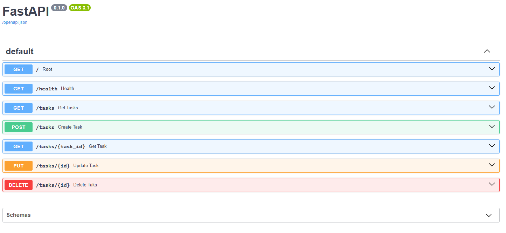

# BE-01 Build your first CRUD API🚀

A simple RESTful API built with **FastAPI** and Python to manage a task list (full CRUD).

## Installation and Execution

To install the necessary dependencies and start the server locally, run the following command in your terminal:

```bash
pip install fastapi uvicorn pydantic && uvicorn main:app --reload

```

## Endpoints

| Method | Path | Description |
| --- | --- | --- |
| `GET` | `/` | Shows the main API information. |
| `GET` | `/health` | Checks the server status. |
| `GET` | `/tasks` | Retrieves the complete list of tasks. |
| `GET` | `/tasks/{id}` | Finds and returns a specific task by ID. |
| `POST` | `/tasks` | Creates a new task. |
| `PUT` | `/tasks/{id}` | Updates the title or status of an existing task. |
| `DELETE` | `/tasks/{id}` | Permanently deletes a task. |

## Example Request (cURL)

Request to create a new task and its successful response with a 201 status code:

```bash
$ curl -i -X POST http://localhost:8000/tasks -H "Content-Type: application/json" -d '{"title": "Publish my API to GitHub"}'

HTTP/1.1 201 Created
server: uvicorn
content-length: 64
content-type: application/json

{"id": 4, "title": "Publish my API to GitHub", "done": false}
```

## Interactive Documentation (Swagger UI)



