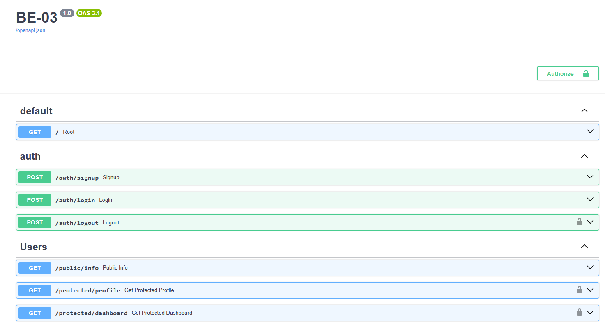

# BE-03 - Auth Login & protect

## What is this project?
This project is a FastAPI-based backend application that implements a complete authentication and authorization flow using Supabase. It features user registration, login, token-based session management (logout), and protected routes using custom middleware dependencies to validate JSON Web Tokens (JWT). The architecture strictly follows a layered approach (Routes, Services, Schemas, Dependencies) to ensure clean, scalable, and maintainable code.

## Environment Variables Setup
To run this project, you need to configure your environment variables. Create a `.env` file in the root directory of your project and add the following keys with your Supabase credentials:

SUPABASE_URL=https://your-project-id.supabase.co
SUPABASE_KEY=your_super_secret_anon_key

Note: Ensure that the `SUPABASE_URL` does NOT contain a trailing slash or `/rest/v1` path.

## How to run the project
Once your environment variables are set, you can start the development server with a single command:

```bash
python main.py
(Alternatively, you can run: uvicorn src.app:app --host 0.0.0.0 --port 8000 --reload)
```
## API Reference

| Endpoint | Method | Description | Requires Auth (Token) |
| :--- | :--- | :--- | :--- |
| `/` | GET | Server health check and Supabase connection status | No |
| `/auth/signup` | POST | Registers a new user | No |
| `/auth/login` | POST | Authenticates a user and returns an access token | No |
| `/auth/logout` | POST | Invalidates the user's current session | Yes |
| `/public/info` | GET | Returns a public welcome message | No |
| `/protected/profile` | GET | Returns the authenticated user's metadata | Yes |
| `/protectec/dashboard` | GET | Dashboard's access | Yes |

## Swagger UI Screenshot
