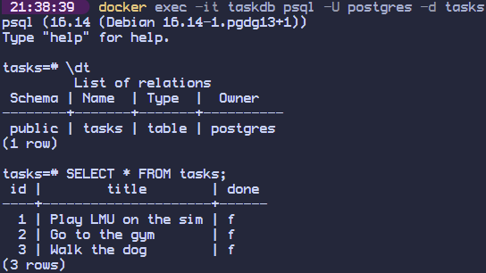

# BE-04 A3 Containerize your stack

This is a RESTful CRUD API for managing tasks, built with Python. It runs against a real PostgreSQL database, and the entire stack (application + database) is containerized using Docker for a seamless, "works on every machine" setup.

## Quick Start

1. **Set up environment variables:** 
   Look at the `.env.example` file to see which variables need to be set. Copy this file to create your own local `.env` file containing the connection string:
   ```bash
   cp .env.example .env
2. **Start the entire stack:**
Run the application and the database together with this single command:
    ```bash
    docker compose up
    ```
## Endpoints

| Method | Path | Description |
| --- | --- | --- |
| `GET` | `/` | Shows the main API information. |
| `GET` | `/health` | Checks the server status. |
| `GET` | `/tasks` | Retrieves the complete list of tasks. |
| `GET` | `/tasks/{id}` | Finds and returns a specific task by ID. |
| `POST` | `/tasks` | Creates a new task. |
| `PUT` | `/tasks/{id}` | Updates the title or status of an existing task. |
| `DELETE` | `/tasks/{id}` | Permanently deletes a task. |

## Example Request
**Command:**
```bash
curl -X 'GET' \
  'http://localhost:3000/tasks' \
  -H 'accept: application/json'
```

**Response:**
```bash
 HTTP/1.1 200 OK
 content-length: 154 
 content-type: application/json 
 date: Sat,01 Aug 2026 03:31:31 GMT 
 server: uvicorn 
{
  "tasks": [
    {
      "id": 1,
      "title": "Play LMU on the sim",
      "done": false
    },
    {
      "id": 2,
      "title": "Go to the gym",
      "done": false
    },
    {
      "id": 3,
      "title": "Walk the dog",
      "done": false
    }
  ]
}
```

## Database Evidence
