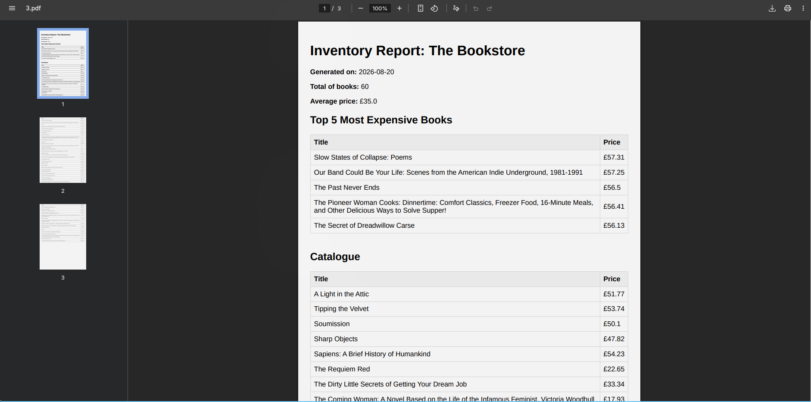

# FLYRANK CAPSTONE: PDF REPORT GENERATOR (A8)

## 1. PROJECT DESCRIPTION & DATASET
-----------------------------------------------------------------------
This project is an API that queries a SQLite database, aggregates the 
data, renders it into a PDF report using Playwright, and serves the 
file by link. 

Dataset chosen: Option B - The Bookstore. It uses 60 real book records 
scraped from books.toscrape.com during a previous assignment.


## 2. HOW TO RUN THE PROJECT
-----------------------------------------------------------------------
STEP 1: Set up the environment
```bash
$ python3 -m venv .venv
$ source .venv/bin/activate
$ pip install fastapi uvicorn playwright
$ playwright install chromium
```

STEP 2: Seed the database
This script creates report.db, clears existing data, and inserts the 
60 book records[cite: 1].
```bash
$ python src/database/seed.py
```

STEP 3: Start the API server
```bash
$ uvicorn main:app --reload
```
The server will run on `http://localhost:8000`


## 3. AGGREGATION SQL QUERIES
-----------------------------------------------------------------------
The following queries are used to generate the report[cite: 1]:

- Total number of books:
  SELECT COUNT(*) as total FROM books

- Average price:
  SELECT AVG(price) as avg_price FROM books

- Top 5 most expensive books:
  SELECT title, price FROM books ORDER BY price DESC LIMIT 5

- Number of books per star rating:
  SELECT rating, COUNT(*) as count FROM books GROUP BY rating ORDER BY rating DESC


## 4. ENDPOINT PROOF (POST -> DOWNLOAD)
-----------------------------------------------------------------------
Generate the report:
```json
$ curl -i -X POST http://localhost:8000/reports
Response: HTTP 201 Created
{
  "id": 1,
  "file": "/reports/1/file"
}
```

Download the generated report[cite: 1]:

```bash
$ curl -o my-report.pdf http://localhost:8000/reports/1/file
```
(This downloads a valid, 2+ page PDF file with clean page breaks).


## 5. ARCHITECTURE REFLECTIONS (STAGES 4 & 5)
-----------------------------------------------------------------------
### Stage 4 (Background Jobs):
Q: At what point would you move this work out of the request?[cite: 1]
A: I would move this work to a background job when the PDF generation 
takes more than a few seconds or when there is a high volume of concurrent 
users, to prevent keeping the user waiting (hanging the request) and 
blocking server resources.

### Stage 5 (Idempotency):
Q: What does the idempotency check protect against, and what is a 
real-world example where a missing check costs money?[cite: 1]
A: The check protects against duplicate processing, such as a user 
double-clicking the "Generate report" button. A real-world example 
where a missing check costs money is in a payment gateway, where 
charging a customer twice for the same click would lead to financial 
loss, disputes, and ruined trust.


## 6. SCREENSHOT PROOF
-----------------------------------------------------------------------


=======================================================================